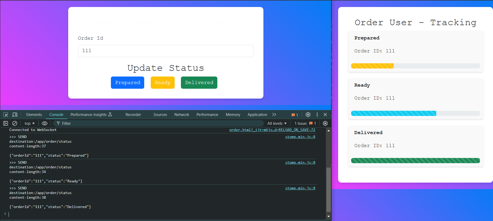

# RTNS (Real Time Notification System)

An attempt to implement the real time notification system using the concept of web socket in spring boot 
To try out the code here
- Clone the repo ( you need JDK to be 21 or higher).
- open the `order.html` and `order-client.html` in you browser
- enter an order Id and click on the status `Prepared`, `Ready` , `Dilivered`.
- the order page takes the orderId and sends the status to a message broker
- order-client on the other hand had subscribed to that broker so wherever something is received on that broker it picks up the show on th escreen.

